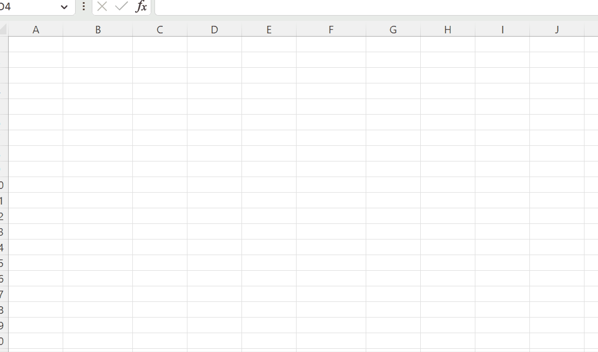

# Excel Minder
A scalable realtime financial data processing environment. Excel/Python/Web.

## Click the _gif_ below:

## TODO: 
- [x] Add ExcelDNA Project 
- [x] Add Stock Simulator
- [x] Add Web Application Project
- [x] Add gRPC Support 
- [x] Add C# gRPC to Web API Project 
- [x] Add Python Project
- [ ] Add Python FastAPI Project
- [x] Add Python gRPC API Project
- [ ] Add Python gRPC remote client Project
- [ ] Add a simple Ribbon to the Excel Addin
- [ ] Refactor Simulation to realistic data
- [x] Add connection to Alpha Vantage from Python
- [ ] Add prices from Alpha Vantage 
- [ ] Add Tensorflow-based Quantitative Analysis library from https://github.com/google/tf-quant-finance
